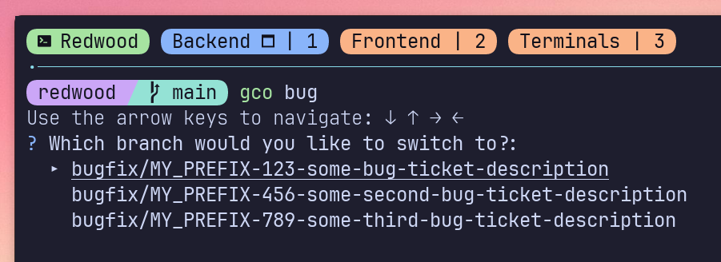
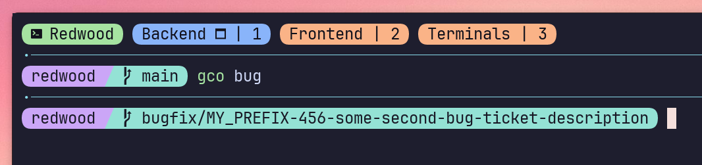
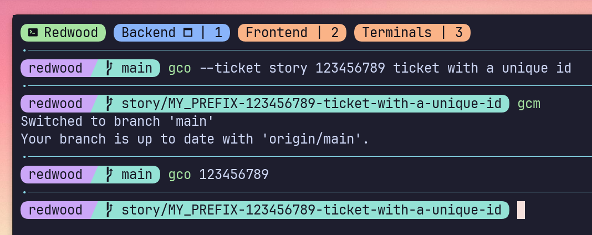

# gco

## Installation

```sh
go get github.com/adaviloper/gco@latest
```

## Configuration

```yaml
// ~/.config/gco/config.yaml
repositories:
  default:
    ticket_prefix: MY_PREFIX
    bug: bugfix // optional
    // add whatever additional mappings you'd like for whatever <ticket-type> value you pass in
separator: "/"
```

## Description

Git utility to simplify creating and switching branches based on a provided pattern matching.

### Branch switching
#### Branch creation example


#### Before selection fro duplicate local branches



#### After selection fro duplicate local branches



#### Automatic selection from unique branch substring



```sh
gco some-full-branch-name
gco <ticket-number>
gco <partial-string-match>
```

### Branch Creation


```sh
gco --ticket <ticket-type> <ticket-id> <some-arbitrary-length-ticket-description>
```

#### Suggested aliases

```sh
alias bug="gco --ticket bug"
alias epic="gco --ticket epic"
alias revert="gco --ticket revert"
alias spike="gco --ticket spike"
alias story="gco --ticket story"
alias task="gco --ticket task"

# Invoke with
bug 123 some bug ticket description
// bugfix/MY_PREFIX-123-some-bug-ticket-description
epic 123 some epic ticket description
// epic/MY_PREFIX-123-some-epic-ticket-description
revert 123 some revert ticket description
// revert/MY_PREFIX-123-some-revert-ticket-description
spike 123 some spike ticket description
// spike/MY_PREFIX-123-some-spike-ticket-description
story 123 some story ticket description
// story/MY_PREFIX-123-some-story-ticket-description
task 123 some bug ticket description
// task/MY_PREFIX-123-some-task-ticket-description
```

## Flags


| Flag | Name | Description |
|--- | --- | --- |
| -r       | remote | Include parsing through remote branches |
| --ticket | ticket   | Create a ticket branch with the mapped prefix |
---


